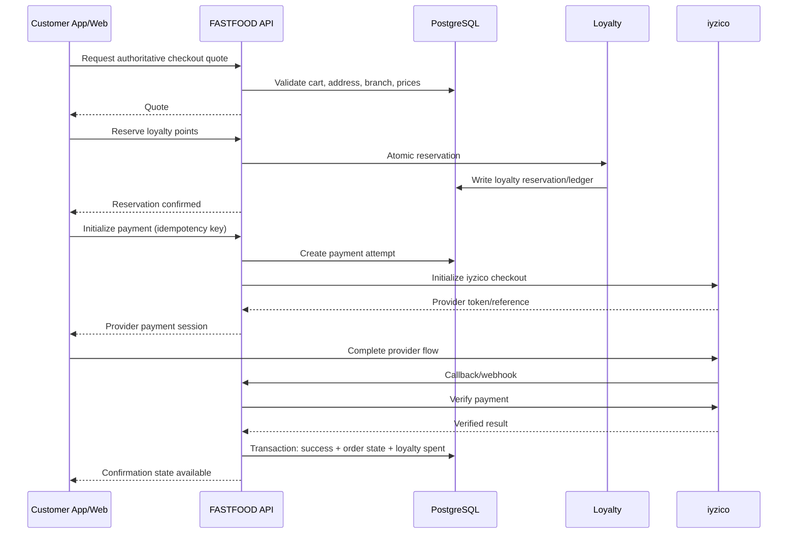
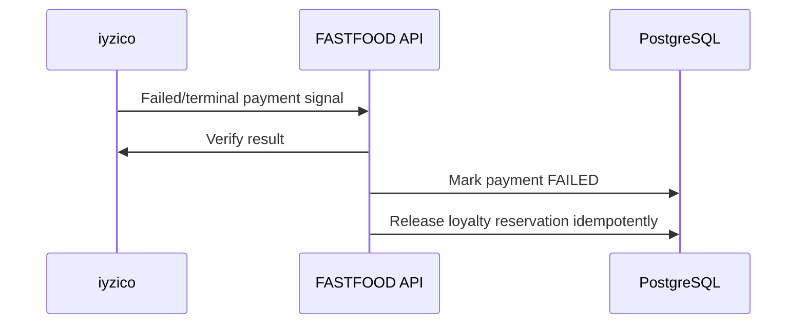
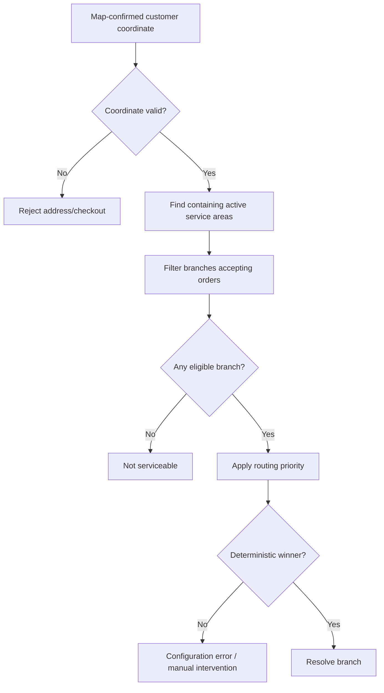
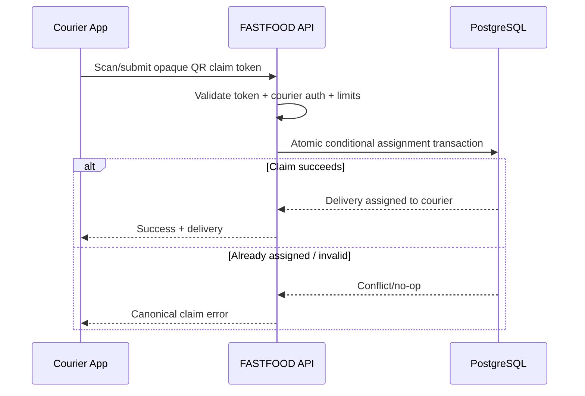
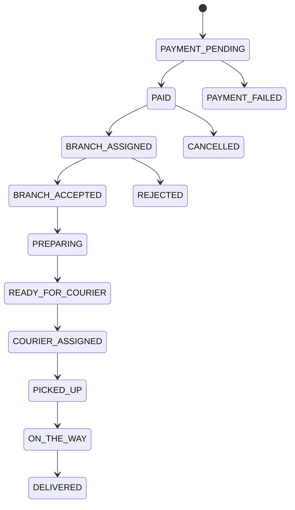
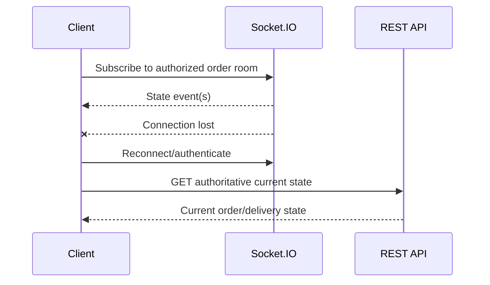

# Sequence and State Diagrams

## 1. Checkout and payment

```mermaid
sequenceDiagram
    participant C as Customer App/Web
    participant API as FASTFOOD API
    participant DB as PostgreSQL
    participant L as Loyalty
    participant I as iyzico

    C->>API: Request authoritative checkout quote
    API->>DB: Validate cart, address, branch, prices
    API-->>C: Quote
    C->>API: Reserve loyalty points
    API->>L: Atomic reservation
    L->>DB: Write loyalty reservation/ledger
    API-->>C: Reservation confirmed
    C->>API: Initialize payment (idempotency key)
    API->>DB: Create payment attempt
    API->>I: Initialize iyzico checkout
    I-->>API: Provider token/reference
    API-->>C: Provider payment session
    C->>I: Complete provider flow
    I->>API: Callback/webhook
    API->>I: Verify payment
    I-->>API: Verified result
    API->>DB: Transaction: success + order state + loyalty spent
    API-->>C: Confirmation state available
```

## 2. Failed payment loyalty release

```mermaid
sequenceDiagram
    participant I as iyzico
    participant API as FASTFOOD API
    participant DB as PostgreSQL

    I->>API: Failed/terminal payment signal
    API->>I: Verify result
    API->>DB: Mark payment FAILED
    API->>DB: Release loyalty reservation idempotently
```

## 3. Branch routing

```mermaid
flowchart TD
    A[Map-confirmed customer coordinate] --> B{Coordinate valid?}
    B -- No --> X[Reject address/checkout]
    B -- Yes --> C[Find containing active service areas]
    C --> D[Filter branches accepting orders]
    D --> E{Any eligible branch?}
    E -- No --> Y[Not serviceable]
    E -- Yes --> F[Apply routing priority]
    F --> G{Deterministic winner?}
    G -- No --> Z[Configuration error / manual intervention]
    G -- Yes --> H[Resolve branch]
```

## 4. QR claim

```mermaid
sequenceDiagram
    participant Q as Courier App
    participant API as FASTFOOD API
    participant DB as PostgreSQL

    Q->>API: Scan/submit opaque QR claim token
    API->>API: Validate token + courier auth + limits
    API->>DB: Atomic conditional assignment transaction
    alt Claim succeeds
      DB-->>API: Delivery assigned to courier
      API-->>Q: Success + delivery
    else Already assigned / invalid
      DB-->>API: Conflict/no-op
      API-->>Q: Canonical claim error
    end
```

## 5. Fulfillment state

```mermaid
stateDiagram-v2
    [*] --> PAYMENT_PENDING
    PAYMENT_PENDING --> PAID
    PAYMENT_PENDING --> PAYMENT_FAILED
    PAID --> BRANCH_ASSIGNED
    BRANCH_ASSIGNED --> BRANCH_ACCEPTED
    BRANCH_ACCEPTED --> PREPARING
    PREPARING --> READY_FOR_COURIER
    READY_FOR_COURIER --> COURIER_ASSIGNED
    COURIER_ASSIGNED --> PICKED_UP
    PICKED_UP --> ON_THE_WAY
    ON_THE_WAY --> DELIVERED
    PAID --> CANCELLED
    BRANCH_ASSIGNED --> REJECTED
```

## 6. Realtime recovery

```mermaid
sequenceDiagram
    participant UI as Client
    participant WS as Socket.IO
    participant API as REST API

    UI->>WS: Subscribe to authorized order room
    WS-->>UI: State event(s)
    WS--xUI: Connection lost
    UI->>WS: Reconnect/authenticate
    UI->>API: GET authoritative current state
    API-->>UI: Current order/delivery state
```
